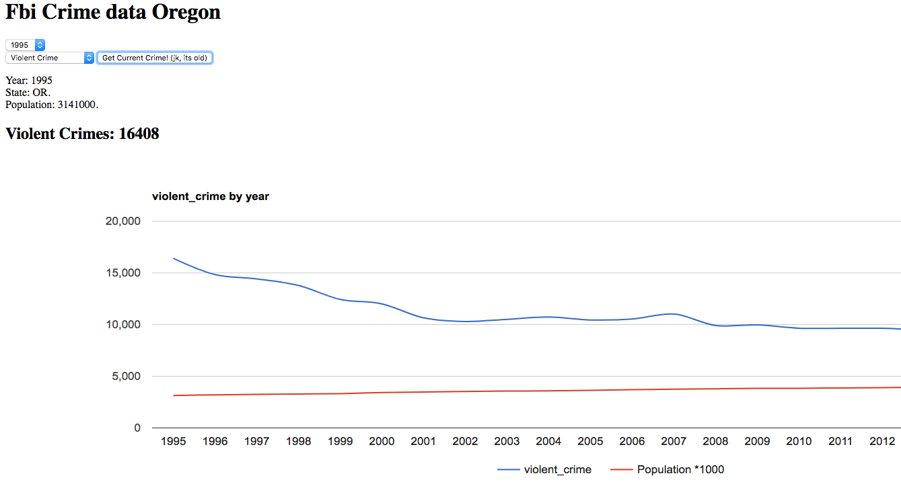

# FBI Crime database (Oregon)

### Authors: Nate McGregor and Margaret Berry

This program utilizes the FBI crime database to return statistics in a graph by year.




## Setup Instructions:

from the command line...
```
git clone https://github.com/hal2814/fbi-data.git

cd fbi-data

npm install

gulp build

gulp serve
```

Use the tabs to search specific crimes, or select a specific year to see statistics for only that year.


#### _Technologies used:_
Javascript, npm, gulp, Karma, fbi crime database api


copyright Nate McGregor Margaret Berry 2017
